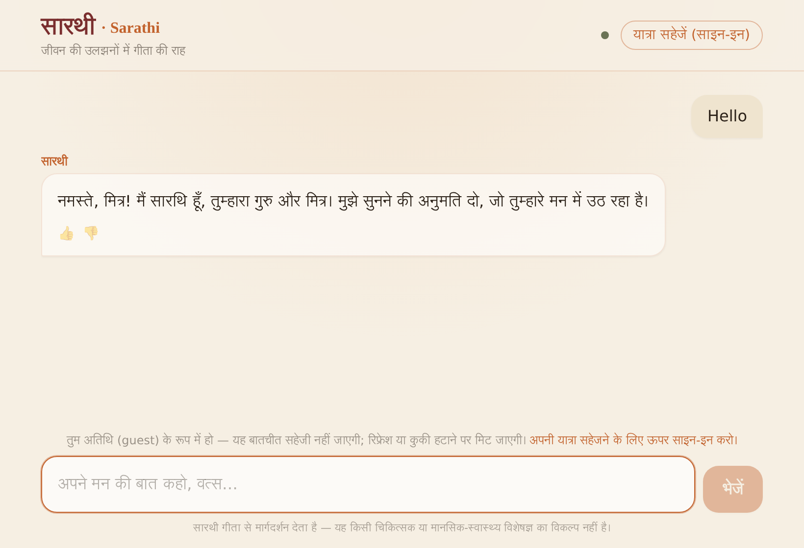
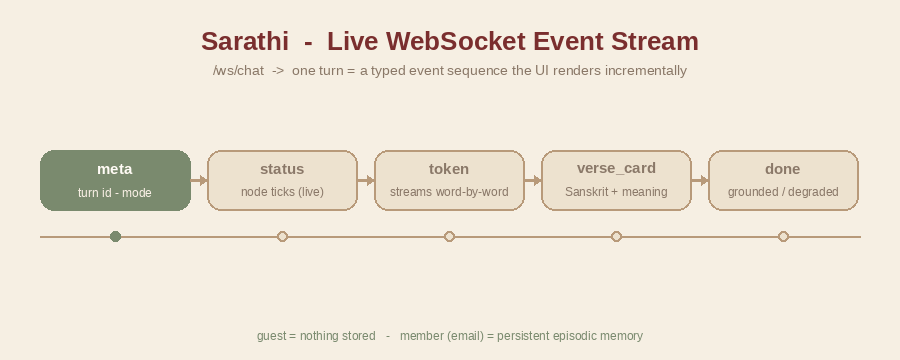

<h1 align="center">🪈 Sarathi — Frontend</h1>

<p align="center">
  <b>The chat interface for the Sarathi Bhagavad-Gītā guru.</b><br/>
  A calm, temple-inspired UI that streams guidance in शुद्ध हिंदी and reveals the verse as a card.
</p>

<p align="center">
  
  
  
  
</p>

<p align="center">
  
</p>

<p align="center">
  <sub>Parchment & saffron theme · Devanagari typography · <b>listen-first</b>: a greeting is met with a warm greeting, not a forced verse. (Real problems get insight + an expandable verse card.)</sub>
</p>

---

## 📑 Table of contents

- [How it talks to the backend](#-how-it-talks-to-the-backend) · [Tech stack](#-tech-stack) · [Project structure](#-project-structure)
- [Quick start](#-quick-start) · [Configuration](#%EF%B8%8F-configuration) · [Design language](#-design-language) · [Future scope](#-future-scope)

---

## 🔄 How it talks to the backend

The UI opens a single **WebSocket** to `/ws/chat`. One turn arrives as a typed event sequence that the
interface renders **incrementally** — status ticks, then word-by-word Hindi, then the verse card.

<p align="center">
  
</p>

| Event | Rendered as |
|-------|-------------|
| `meta` | turn id + `response_mode` |
| `status` | live "thinking" line (e.g. *सुन रहा हूँ*, *ग्रंथों में देख रहा हूँ*) per node |
| `token` | Hindi guidance streamed word-by-word |
| `verse_card` | canonical Sanskrit + IAST + meaning + word-by-word (`VerseCard`) |
| `safety` | crisis helpline card (`SafetyCard`) |
| `done` | final flags — `verse_id`, `grounded`, `degraded` |
| `error` | graceful Hindi error envelope |

All of this lives in the **`lib/useSarathi.js`** hook (connect, stream accumulation, `send`,
`authenticate`, `signOut`, `localStorage` email).

---

## 🧰 Tech stack

| Layer | Choice |
|-------|--------|
| Framework | **Next.js 14** (App Router, JavaScript) |
| UI | **React 18** + **Tailwind CSS 3** |
| Fonts | Noto Sans / Serif **Devanagari** (with system fallback) |
| Transport | Native **WebSocket** to the FastAPI backend |
| Server | `next dev` / `next start`, or the custom `server.js` |

---

## 📂 Project structure

```text
frontend/
├── server.js                # custom Node server (HOST/PORT/NODE_ENV) — analogue of backend/asgi.py
├── app/
│   ├── layout.js            # fonts, metadata
│   ├── page.js              # chat screen
│   └── globals.css          # theme tokens + Devanagari @import
├── components/
│   ├── TopBar.js            # brand + guest/member state
│   ├── Message.js           # a turn bubble
│   ├── VerseCard.js         # Sanskrit / IAST / meaning / श्लोक breakdown
│   ├── SafetyCard.js        # crisis helplines
│   ├── StatusLine.js        # live node status
│   └── Composer.js          # input box
├── lib/useSarathi.js        # the WebSocket hook
├── docs/                    # ui-preview.png · event-stream.gif
└── tailwind.config.js
```

---

## 🚀 Quick start

> **Prerequisites:** Node 18+ (tested on Node 22) and a running [backend](../backend/README.md).

```bash
npm install

# point at the backend (defaults already match asgi.py's port 8088)
cp .env.local.example .env.local         # then edit if needed

# development (hot-reload)
npm run dev
#    └─ or via the custom server:  npm run serve:dev

# production
npm run build && npm run start           # or: npm run serve
```

Open **http://localhost:3000**.

---

## ⚙️ Configuration

`.env.local`:

| Variable | Default | Purpose |
|----------|---------|---------|
| `NEXT_PUBLIC_SARATHI_WS_URL` | `ws://localhost:8088/ws/chat` | Backend WebSocket endpoint |
| `NEXT_PUBLIC_SARATHI_API_URL` | `http://localhost:8088` | Backend REST base (auth / session) |

`server.js` knobs: `HOST` (default `127.0.0.1`), `PORT` (default `3000`), `NODE_ENV`.

---

## 🎨 Design language

> *Calm, warm, unhurried — a quiet temple, not a chat app.*

| Token | Value |
|-------|-------|
| Parchment (background) | `#f6efe3` |
| Saffron (accent) | `#c2622d` |
| Maroon (text / headings) | `#7a2e2e` |
| Sage (muted) | soft green-grey |

- **Devanagari-first** typography; the user is addressed as **तुम** with warm vocatives.
- Insight streams first; the **verse card** expands as *proof*, never as the headline.
- Honest UI: a `degraded` chip when a fallback model answered; guests are told nothing is stored.

---

## 🔭 Future scope

**Experience**
- [ ] Email **OTP** login flow + a "your journey" view of past episodes (members).
- [ ] Smoother verse-reveal animation; markdown / rich formatting in guidance.
- [ ] Voice input + Hindi text-to-speech for an audio guru.
- [ ] Dark / low-light "evening" theme.

**Reach & quality**
- [ ] Full **accessibility** pass (screen-reader labels, focus traps, reduced-motion).
- [ ] **i18n** UI (regional Indian languages) matching the backend's multilingual roadmap.
- [ ] **PWA** / installable + offline shell; mobile-first polish.
- [ ] **E2E tests** (Playwright) for the streaming + reconnection flows.

---

<p align="center"><sub>Insight first, source second. 🙏</sub></p>
